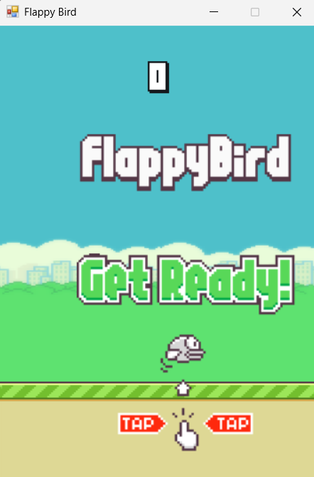

# 🐦 Flappy Bird

> 📚 Developed as a weekly assignment for **YMT-218 Object-Oriented Programming** course.

A Flappy Bird clone built with C# and WinForms as an Object-Oriented Programming course assignment.



---

## 🛠️ Technologies

| Technology | Purpose |
|---|---|
| C# (.NET) | Core programming language |
| WinForms | Game window and rendering |
| GDI+ (System.Drawing) | 2D graphics and image rendering |
| System.Media | Audio playback |
| Git | Version control |

---

## 🏗️ OOP Architecture

The project is structured around core OOP principles. Every game object shares a common base, while each class is responsible only for its own behavior.

### Class Hierarchy

```
IDrawable         IUpdatable
    └──────┬───────────┘
       GameObject  (abstract)
           ├── Bird
           ├── Pipe
           └── Background

SoundManager      (standalone — no visual representation)
GameManager       (standalone — orchestrates all objects)
GameState         (enum — Menu, Playing, Dead)
```

### OOP Principles in Practice

**Abstraction & Inheritance**
`GameObject` is an abstract base class that holds shared properties (`X`, `Y`, `Width`, `Height`) and enforces a contract via abstract methods. `Bird`, `Pipe`, and `Background` all inherit from it, getting the common foundation for free while implementing their own `Draw()` and `Update()` logic.

**Encapsulation**
Internal state is kept private. For example, `Bird`'s velocity (`_velocityY`) and animation frames (`_frames`) are not accessible from outside. The only public-facing behavior is `Flap()` — callers don't need to know anything about the physics underneath.

**Polymorphism**
`GameManager` holds a list of `Pipe` objects and calls `Update()` and `Draw()` on each one without knowing their internals. Every `GameObject` subclass responds to the same interface but behaves differently.

**Interfaces**
`IDrawable` and `IUpdatable` define contracts independently. This allows objects like a future `ScoreText` to be drawable without needing physics updates — more flexible than a single abstract class alone.

**Composition over Inheritance**
`SoundManager` is not a `GameObject` — it has no position or visual. It is composed inside `GameManager` as a field (`has-a` relationship), demonstrating that inheritance should only be used when a true `is-a` relationship exists.

**Separation of Concerns**
Each class owns exactly one responsibility:
- `Bird` — physics and animation
- `Pipe` — scrolling and collision bounds
- `Background` — seamless scroll loop
- `SoundManager` — audio playback
- `GameManager` — game state, scoring, spawning, collision detection
- `GameForm` — window, input handling, game loop

---

## 🎮 How to Play

- Press **Space** or **click** to flap
- Fly through the gaps between pipes
- Each pipe passed = +1 score
- Don't hit the pipes or the ground!

---

## 📦 Assets

Sprites and audio sourced from [samuelcust/flappy-bird-assets](https://github.com/samuelcust/flappy-bird-assets) (MIT License).
